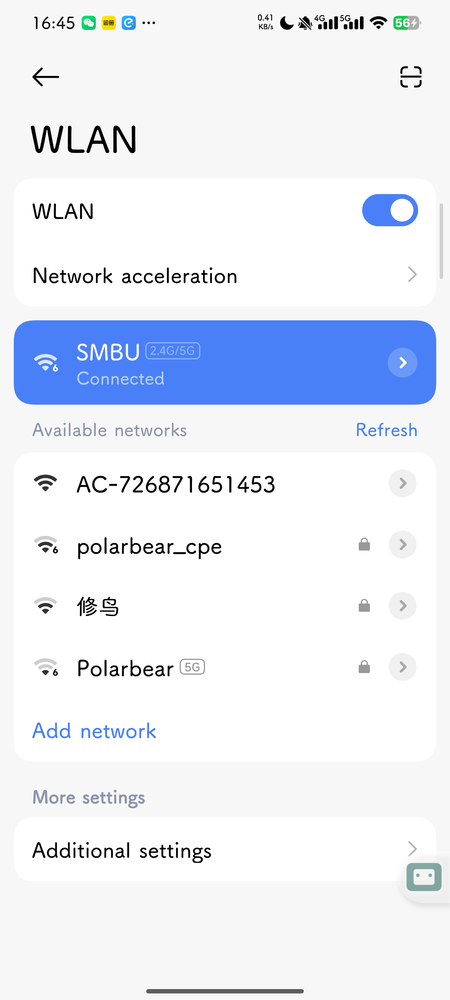

# AutoGLM Mobile Agent（Android 原生手机 Agent App）

> 一个**完整运行在 Android 手机上**的 AI 手机操作助手。用户用自然语言下达任务，App 在本机截屏、调用 AutoGLM 视觉模型理解屏幕、解析出动作，并通过 Android 无障碍服务（AccessibilityService）执行点击/输入/滑动/返回，全过程展示推理与动作日志，敏感操作需人工确认。
>
> 本项目是 [Open-AutoGLM](https://github.com/zai-org/Open-AutoGLM) 的**移动端原生复刻**：保留其 Agent 闭环、动作协议、模型与坐标系统，只把执行层从「PC + ADB」换成「手机 + AccessibilityService」。

## 当前 MVP 状态

本目录已经包含可打开的 Android 原生 MVP 工程，不再只是设计文档。实现范围见 [MVP_NOTES.md](MVP_NOTES.md)。

核心代码位置：

- `app/src/main/java/com/example/autoglmagent/MainActivity.kt`：Compose 入口。
- `app/src/main/java/com/example/autoglmagent/ui/AgentApp.kt`：任务、配置、截图、Trace 和敏感确认 UI。
- `app/src/main/java/com/example/autoglmagent/service/AgentAccessibilityService.kt`：无障碍截图、前台 App、点击/滑动/输入/返回/启动 App。
- `app/src/main/java/com/example/autoglmagent/agent/AgentOrchestrator.kt`：Agent Loop 和状态机。
- `app/src/main/java/com/example/autoglmagent/agent/OpenAiModelClient.kt`：OpenAI-compatible 模型请求。
- `app/src/main/java/com/example/autoglmagent/agent/ActionParser.kt`：Open-AutoGLM `do()/finish()` 动作解析。

本机运行方式：

```bash
./gradlew assembleDebug
```

或使用 Android Studio 打开本目录，连接 Android 11+ 设备，安装 Debug APK 后在系统设置中开启“AutoGLM 手机 Agent”无障碍服务。

真机 Demo 证据：



Demo 视频：[demo/autoglm-demo.mp4](demo/autoglm-demo.mp4)

对应任务：`打开设置，进入 Wi-Fi 页面`。实测流程为 App 截图 → 请求 `autoglm-phone` → 执行 `Launch(系统设置)` → 二次截图识别 WLAN 页面 → `finish(message=...)`。

---

## 0. 作业要求对照（先扣题）

| 作业要求 | 本方案如何满足 | 对应章节 |
|---|---|---|
| **① 基于 Open-AutoGLM** | 复用其 system prompt、`do()/finish()` 动作协议、0–999 相对坐标、单截图上下文管理；默认直接调用智谱 `autoglm-phone` 同一模型 | §2 §4 §5 §6 |
| **② 利用 vibe coding** | 按「Observation / Model / Action / Safety / Trace」分层，用 AI 编程逐模块生成并迭代，保留 prompt 与迭代记录作为交付物 | §10 |
| **③ 移动端 App** | Kotlin + Jetpack Compose 原生 Android 应用，可打包 APK 侧载安装 | §3 §8 |
| **④ 能在手机上运行** | 截图、模型调用（HTTP）、动作执行全部在手机本机完成，**不依赖 PC、不依赖 ADB** | §3 §5 §6 |

> 关键区别于「手机当遥控器 + PC 跑 Open-AutoGLM」：本方案的 Agent 闭环**整体跑在手机上**，这才满足「App 本身在手机上运行」。

---

## 1. 为什么不是直接打包 Open-AutoGLM

读过上游源码后可以确认，Open-AutoGLM 是**运行在电脑/服务器上的 Python 框架**，执行层是 `adb` / `hdc` / WebDriverAgent 三套子进程命令（`phone_agent/adb/`、`phone_agent/hdc/`、`phone_agent/xctest/`）。它无法直接打包成手机 App。

因此本项目的做法是：**借走它的"大脑"，换掉它的"手"**——

| 层 | Open-AutoGLM（上游） | 本项目（移动端） |
|---|---|---|
| 截图 | `adb exec-out screencap` | `AccessibilityService.takeScreenshot()`（API 30+）/ MediaProjection 兜底 |
| 当前 App | `adb shell` 查询前台包名 | `AccessibilityEvent` / `rootInActiveWindow.packageName` |
| 模型 | OpenAI-compatible HTTP | **同一接口、同一模型**，手机端 OkHttp 直连 |
| 动作执行 | `adb shell input tap/swipe/...` | `dispatchGesture` / `performGlobalAction` |
| 文本输入 | ADB Keyboard（外部输入法） | `ACTION_SET_TEXT` → 剪贴板粘贴，逐级兜底 |

「大脑」（system prompt、动作协议、坐标系、Agent Loop）**一字不改地保留**，所以仍然是"基于 Open-AutoGLM"。

---

## 2. Agent Loop（从 `phone_agent/agent.py` 移植）

上游主循环（`PhoneAgent._execute_step`）的结构原样保留，只替换观察端与执行端：

```text
while (!finished && step < maxSteps && !cancelled) {
    screenshot   = observer.takeScreenshot()          // AccessibilityService
    currentApp   = observer.foregroundPackage()        // 前台包名
    messages     = promptBuilder.build(task, history, screenshot, currentApp)
    response     = modelClient.request(messages)        // 调 autoglm-phone
    (think, raw) = splitThinkingAndAction(response)     // 见 §6
    action       = parseAction(raw)                     // do()/finish() DSL
    if (safetyGate.isSensitive(action)) {               // action 带 message= 字段
        if (!safetyGate.confirm(action)) break
    }
    result = actionExecutor.execute(action, screenW, screenH)
    history.add(Step(screenshot, think, action, result))
    history.stripImagesExceptLatest()                   // 关键：只留最新一张截图
    if (action.isFinish) finished = true
}
```

**两个必须照搬的实现细节**（否则会偏离上游、token 爆炸或解析失败）：

1. **单截图上下文**：每步把上一条 user 消息里的图片删掉，整个对话历史中**任何时刻只保留当前这一张截图**（上游 `agent.py:205` `remove_images_from_message`）。历史只保留文本化的 `<think>../<answer>..`。
2. **assistant 历史格式**：模型回复要按 `"<think>{thinking}</think><answer>{action}</answer>"` 拼回 assistant 消息再入历史（上游 `agent.py:220-224`）。

---

## 3. 系统架构

```text
┌──────────────────────────────────────────────┐
│              App UI (Jetpack Compose)          │
│  任务输入 / 模型配置 / 权限引导 / 实时 Trace      │
└───────────────────────┬──────────────────────┘
                        │
┌───────────────────────▼──────────────────────┐
│        TaskOrchestrator（状态机/暂停/停止/重试）  │
└───────────────────────┬──────────────────────┘
                        │
┌───────────────────────▼──────────────────────┐
│   Agent Core: PromptBuilder / ActionParser /   │
│               ContextManager / SafetyGate      │
└──────────────┬──────────────────┬─────────────┘
               │                  │
┌──────────────▼──────┐   ┌───────▼──────────────┐
│  Observation Layer   │   │     Model Layer       │
│ takeScreenshot /      │   │ OkHttp → autoglm-phone│
│ foreground package    │   │ (OpenAI-compatible)   │
└──────────────┬──────┘   └───────┬──────────────┘
               │                   │
┌──────────────▼───────────────────▼────────────┐
│  ActionExecutor: tap/swipe/type/back/home/...  │
└───────────────────────┬──────────────────────┘
                        │
┌───────────────────────▼──────────────────────┐
│   AgentAccessibilityService (前台 Service)      │
│  dispatchGesture / performGlobalAction /        │
│  takeScreenshot / getRootInActiveWindow         │
└──────────────────────────────────────────────┘
```

**技术栈**：Kotlin · Jetpack Compose · Coroutines + Flow · OkHttp · DataStore（存模型配置）· Room（存 Trace，可选）· AccessibilityService + ForegroundService。

---

## 4. 模型与提示词（高保真复用上游）

### 4.1 默认模型：智谱 `autoglm-phone`（推荐）

为了真正"基于 Open-AutoGLM"且最省力、demo 最稳，**默认档直接调用上游同款模型**，无需 PC、无需本地部署：

| 配置项 | 值 |
|---|---|
| Base URL | `https://open.bigmodel.cn/api/paas/v4` |
| Model | `autoglm-phone` |
| API Key | 在智谱 BigModel 平台申请 |

> 备选：ModelScope（`https://api-inference.modelscope.cn/v1` + `ZhipuAI/AutoGLM-Phone-9B`），或自建 vLLM/SGLang 服务后填自己的 URL。

### 4.2 兼容档：通用 VLM（体现扩展性，可选）

配置页允许切换到任意 OpenAI-compatible 多模态模型（如 GLM-4V）。此时用自定义 JSON schema 输出（`{"thought":...,"action":{...}}`）。**注意**：通用 VLM 的坐标 grounding 通常弱于 AutoGLM，demo 默认仍走 4.1。

### 4.3 System Prompt：原样照搬

直接复制上游 `phone_agent/config/prompts_zh.py` 的 `SYSTEM_PROMPT`（含动作指令定义与 18 条规则），作为 app 内置常量。它规定了输出格式：

```text
<think>{推理}</think>
<answer>{do(action="...") 或 finish(message="...")}</answer>
```

以及坐标系：**左上 (0,0) 到右下 (999,999)**。这套不要改，改了就接不住 `autoglm-phone` 的输出。

---

## 5. 模型调用：具体 HTTP 报文

`autoglm-phone` 是 OpenAI-compatible `chat/completions`。手机端 OkHttp 直接构造下列请求即可（与上游 `phone_agent/model/client.py` 完全一致）。

### 5.1 请求体（首步带任务）

```http
POST https://open.bigmodel.cn/api/paas/v4/chat/completions
Authorization: Bearer <API_KEY>
Content-Type: application/json
```

```json
{
  "model": "autoglm-phone",
  "stream": true,
  "max_tokens": 3000,
  "temperature": 0.0,
  "top_p": 0.85,
  "frequency_penalty": 0.2,
  "messages": [
    { "role": "system", "content": "<上游 SYSTEM_PROMPT 全文>" },
    { "role": "user", "content": [
        { "type": "image_url",
          "image_url": { "url": "data:image/png;base64,<截图base64>" } },
        { "type": "text",
          "text": "打开设置进入WiFi页面\n\n{\"current_app\": \"com.android.launcher\"}" }
      ]
    }
  ]
}
```

**后续步骤**的 user 文本改为（无任务、只报屏幕信息）：

```text
** Screen Info **

{"current_app": "com.android.settings"}
```

**关键点**：
- `screen_info` 就是 `{"current_app": "<前台包名>"}` 一个字段的 JSON 字符串（上游 `build_screen_info` 只有这一个字段）。可选地把包名映射成中文 App 名（移植 `config/apps.py` 的反向表）以提升模型识别率。
- 历史里**只有当前这一步带 image_url**，前面所有 user 消息的图片字段都要删掉。
- 历史 assistant 消息形如 `"<think>...</think><answer>do(action=\"Tap\", element=[500,100])</answer>"`。

### 5.2 响应拆分（thinking / action）

按上游 `_parse_response` 规则，对完整文本依次判断：

1. 含 `finish(message=` → 之前是 think，从它起是 action；
2. 否则含 `do(action=` → 同上拆分；
3. 否则含 `<answer>` → 用 XML 标签兜底；
4. 都没有 → think 为空，整段当 action。

> 流式（`stream:true`）可选：先按非流式跑通，再加流式以便 UI 实时显示 think。

---

## 6. `parse_action` 的 Kotlin 移植

上游用 `ast.parse` 解析 `do(...)`。移动端无需完整 AST，用正则即可覆盖全部动作。

```kotlin
sealed interface AgentAction {
    data class Launch(val app: String) : AgentAction
    data class Tap(val x: Int, val y: Int, val sensitiveMsg: String? = null) : AgentAction
    data class Type(val text: String) : AgentAction          // 含 Type_Name
    data class Swipe(val x1: Int, val y1: Int, val x2: Int, val y2: Int) : AgentAction
    data class LongPress(val x: Int, val y: Int) : AgentAction
    data class DoubleTap(val x: Int, val y: Int) : AgentAction
    data class Wait(val seconds: Double) : AgentAction
    data class TakeOver(val message: String) : AgentAction
    data class Finish(val message: String) : AgentAction
    data object Back : AgentAction
    data object Home : AgentAction
    data class Unknown(val raw: String) : AgentAction        // Note/Call_API/Interact 等
}

fun parseAction(raw: String): AgentAction {
    val s = raw.trim()

    Regex("""finish\(message=["']?(.*?)["']?\)""", RegexOption.DOT_MATCHES_ALL)
        .find(s)?.let { return AgentAction.Finish(it.groupValues[1]) }

    val name = Regex("""do\(action=["'](.+?)["']""").find(s)?.groupValues?.get(1)
        ?: return AgentAction.Unknown(s)

    fun coords(key: String): Pair<Int, Int>? =
        Regex("""$key=\[\s*(\d+)\s*,\s*(\d+)\s*]""").find(s)?.let {
            it.groupValues[1].toInt() to it.groupValues[2].toInt()
        }
    fun strArg(key: String): String? =
        Regex("""$key=["'](.*?)["']\s*[,)]""", RegexOption.DOT_MATCHES_ALL)
            .find(s)?.groupValues?.get(1)

    return when (name) {
        "Launch"      -> AgentAction.Launch(strArg("app") ?: "")
        "Tap"         -> coords("element")!!.let { AgentAction.Tap(it.first, it.second, strArg("message")) }
        "Type", "Type_Name" -> AgentAction.Type(strArg("text") ?: "")
        "Swipe"       -> { val a = coords("start")!!; val b = coords("end")!!
                           AgentAction.Swipe(a.first, a.second, b.first, b.second) }
        "Long Press"  -> coords("element")!!.let { AgentAction.LongPress(it.first, it.second) }
        "Double Tap"  -> coords("element")!!.let { AgentAction.DoubleTap(it.first, it.second) }
        "Wait"        -> AgentAction.Wait(
                            Regex("""duration=["']?(\d+(?:\.\d+)?)""").find(s)
                                ?.groupValues?.get(1)?.toDouble() ?: 1.0)
        "Back"        -> AgentAction.Back
        "Home"        -> AgentAction.Home
        "Take_over"   -> AgentAction.TakeOver(strArg("message") ?: "需要人工接管")
        else          -> AgentAction.Unknown(s)   // Note / Call_API / Interact：记录但不操作
    }
}
```

坐标换算（与上游 `_convert_relative_to_absolute` 一致，0–999 → 像素）：

```kotlin
fun toPixel(rx: Int, ry: Int, w: Int, h: Int) = (rx / 1000f * w).toInt() to (ry / 1000f * h).toInt()
```

---

## 7. 动作映射表（AutoGLM → Android AccessibilityService）

| AutoGLM 动作 | Android 实现 |
|---|---|
| `Launch(app)` | 应用名→包名映射后 `PackageManager.getLaunchIntentForPackage()` + `startActivity` |
| `Tap(element)` | `dispatchGesture` 单点点击（50ms） |
| `Tap(element, message=)` | **先弹敏感确认对话框**，允许后再 `dispatchGesture` |
| `Type(text)` / `Type_Name` | 焦点节点 `performAction(ACTION_SET_TEXT)`；失败→自建 IME；再失败→剪贴板粘贴 |
| `Swipe(start,end)` | `dispatchGesture` 路径手势（按距离自适应时长） |
| `Long Press(element)` | `dispatchGesture` 长按（~800ms+） |
| `Double Tap(element)` | 两次快速 `dispatchGesture` |
| `Back` | `performGlobalAction(GLOBAL_ACTION_BACK)` |
| `Home` | `performGlobalAction(GLOBAL_ACTION_HOME)` |
| `Wait(seconds)` | `delay(seconds*1000)` |
| `Take_over(message)` | 弹窗暂停，等用户手动完成后继续 |
| `Note` / `Call_API` / `Interact` | 与上游一致：记录/占位，不实际操作（必要时让用户选择） |
| `finish(message)` | 结束任务，展示 message |

---

## 8. Android 权限与服务

| 能力 | 机制 | 说明 |
|---|---|---|
| 读 UI / 执行手势 / 截图 | `AccessibilityService` | 需用户在「设置→无障碍」手动开启；`AccessibilityServiceInfo` 声明 `canRetrieveWindowContent`、`canPerformGestures` |
| 截图 | `AccessibilityService.takeScreenshot()` | API 30+；低版本用 `MediaProjection`（需 `MediaProjectionManager` 授权弹窗）兜底 |
| 后台常驻 | `ForegroundService` | 任务运行期间保活，常驻通知显示「Agent 运行中 / 停止」 |
| 悬浮停止按钮 | `SYSTEM_ALERT_WINDOW` | 可选；全局「Stop Agent」 |
| 模型调用 | `INTERNET` | 调云端模型 |

UI 树（`getRootInActiveWindow()`）**不喂给模型**（AutoGLM 是纯视觉），仅用于执行端：把模型给的坐标对齐到最近的可点击节点、做兜底定位、判断是否敏感控件。

---

## 9. 安全机制（加分项，必做）

- **敏感操作确认**：模型在涉及支付/隐私/重要按钮时会输出带 `message=` 的 `Tap`（见 system prompt）。命中即弹窗：`[允许一次] [拒绝] [我手动完成]`。
- **人工接管**：`Take_over` 触发登录/验证码场景，暂停并提示用户手动操作。
- **全局停止**：常驻通知 + 悬浮按钮可随时中断循环。
- **隐私最小化**：默认不持久化截图；Trace 仅存文本（think/action/结果）。
- **敏感页拦截**：截图全黑通常是支付/银行类敏感页（上游已知行为），自动转人工接管、不操作。
- **显著披露**：首启展示无障碍用途说明并取得用户同意；项目定位为研究/学习用途，APK 侧载、不上架 Google Play。

---

## 10. vibe coding 工作流（作业要求②，要留痕）

不是"让 AI 乱生成"，而是**按分层拆任务、逐模块用 AI 编程生成并验收**：

1. **拆模块**：Observation / Model / Action / Safety / Trace 五层，每层一个清晰契约（输入输出）。
2. **逐层生成**：用 Claude Code 等按本设计稿的接口生成实现，跑通一层再下一层（见 §11 排期）。
3. **每步可验收**：每个阶段有明确验收标准（Debug 页手动触发），AI 改完即测。
4. **留痕交付**：保存关键 prompt、迭代对话、关键 diff，README 专门写一节「vibe coding 过程」——这是评分项。

---

## 11. MVP 范围与开发排期

> 原则：**先把一条任务端到端跑通 + 用真模型**，其余降级为加分项。

### 阶段一：权限与观察
交付：Compose 首页、权限检测、AccessibilityService、取前台包名、`takeScreenshot` 出图。
验收：打开任意 App，回到本 App 能显示当前包名并截到图。

### 阶段二：动作执行
交付：`dispatchGesture` 的 tap/swipe/longPress/doubleTap、Back/Home、Launch、Type（三级兜底）。
验收：Debug 页输入坐标能点中、输入文本能写进输入框、Back/Home 生效。

### 阶段三：Agent Loop（核心，扣题）
交付：PromptBuilder（§5 报文）、OkHttp ModelClient（调 `autoglm-phone`）、`parseAction`（§6）、ContextManager（单截图）、maxSteps/stop/pause、Trace。
验收：**输入「打开设置，进入 WiFi 页面」，App 自主截图→模型→执行，多步完成并展示每步 think/action。**

### 阶段四：安全与打磨
交付：敏感确认弹窗、人工接管、悬浮停止、Trace 导出、README、架构图、Demo 视频。

### 演示任务（低风险）
1. 打开浏览器搜索「Open-AutoGLM GitHub」
2. 打开设置进入 Wi-Fi 页面
3. 打开地图搜索「附近咖啡店」停在结果页
4. 备忘录新建一条「AutoGLM demo completed」

> 不演示支付/私信/抢票等高风险场景。

---

## 12. 已知限制

- AutoGLM 为纯视觉模型，复杂 WebView/Canvas/游戏页面定位依赖截图质量。
- `ACTION_SET_TEXT` 在部分 App 不稳定，已用 IME/剪贴板兜底；登录/验证码转人工接管。
- 截图全黑的敏感页无法操作（设计如此）。
- 端侧不做本地推理，依赖云端模型，需要网络与 API Key。
- 受 Google Play 无障碍政策限制，仅 APK 侧载演示，不上架。

---

## 13. 交付物清单

```text
1. APK（可侧载安装）
2. GitHub 仓库（本 README + 源码）
3. 架构图
4. Demo 视频：`demo/autoglm-demo.mp4`（阶段三那条端到端任务）
5. 技术报告（本设计稿即可扩展）
6. vibe coding 过程记录（prompt / 迭代）
7. 安全设计与已知限制
```

---

## 14. 参考

- [Open-AutoGLM](https://github.com/zai-org/Open-AutoGLM) — 核心参考：Agent Loop、动作协议、system prompt、模型调用、敏感确认/人工接管。
  - `phone_agent/agent.py` 主循环 · `phone_agent/actions/handler.py` 动作解析与执行 · `phone_agent/model/client.py` 模型客户端 · `phone_agent/config/prompts_zh.py` 提示词与动作格式。
- Android `AccessibilityService`：`dispatchGesture` / `performGlobalAction` / `takeScreenshot` / `getRootInActiveWindow`。

> ⚠️ 仅供研究与学习。所有敏感操作均需用户确认，不得用于非法用途。
